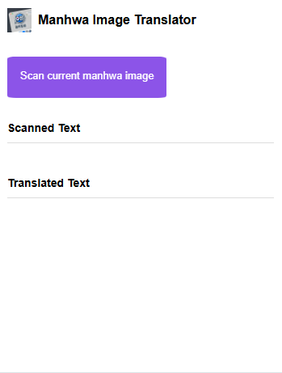
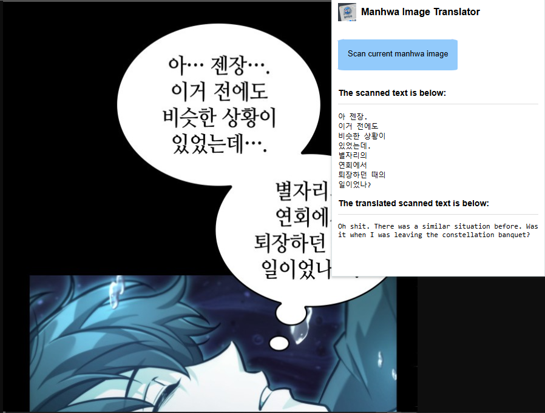

# Manhwa Image Translator

| Contents |
| -------- |
|[About the project](#about-the-project)||
|[Problem solving](#what-problem-is-solves)|
|[Setup/Installation](#setupinstallation-of-the-extension)|
|[Technologies Used](#technologies-used)|
|[Frontend Description](#frontend-description)|
|[Backend Description](#backend-description)|
|[Issues](#issues)|

## About the project
This is a chrome extension which runs locally. When an raw manhwa image is opened on the browser the user has a option to run the extension which will then translate the raw text which is usually in Korean into English.

## What problem it solves
This chrome extension was created because when a user has an image of a raw manhwa and they wish to know what it says. This extension solves that issue where it allows the user to identify what the text means in the image without having to go through a lot of effort just to translate a few words.

## Setup/Installation of the extension

## Technologies Used
- **frontend** - HTML, CSS, Javascript
- **backend** - Node.js, Python, Javascript
- **OCR** - Python
- **Translation** - Python deep_translator library
- **spell checker** - pyspellchecker
- **Image processing** - openCV

## Frontend Description
The frontend of the chrome extension was made using HTML, CSS and Javascript. It is a simple chrome extension pop up window which displays the extensions name but also a button which allows the user to scan the image. There is also a designated section for displaying both the scanned text and translated text. The design is intentionally minimalist ensuring an intuitive and straightforward user experience.

Below is an image of what the extension's UI looks like:

Below is an image of the what the extension's UI looks like when an image has been scanned:

## Backend Description
There are multiple phases for the backend:

1. **Node.js API Server ([server.js](server/server.js))**:
    - The goal of the server is receive the image data from the extension/webpage and passes it to the python script ([speech bubble detection (Korean)](server/koreanSpeechBubbleDetection.py))
    - The server is built using Express.js
    - The server provides a single API endpoint which is `POST /ocr`

2. **Python OCR & Translation Engine ([korean speech bubble detection](server/koreanSpeechBubbleDetection.py))**:
    - This python script is the core of this chrome extension where it is the engine that performs all the actual analysis on the image to extract the text and perform translation on the extracted text
    - It is executed as a child process by the Node.js [server.js](server/server.js) for each API request
    - This python script uses multiple libraries to perform the task:
        - **OpenCV:** For all the image processing tasks such as decode, pre-processing and contour dection
        - **Pytesseract (Tesseract OCR):** This is used to recognising the Korean characters within the speech bubbles. It uses the korean trained data from the tesseract github
        - **Deep Translator:** For translating the extracted Korean text into Korean is done using the Google translate API

3. **Process Workflow:**
    1. **Image capture (client):** The [imageExtractor.js](imageExtractor.js) script runs on the currently active wepage where ti find the target image and draws it in canvas to upscale it but also, to convert the image into Base64 String

    2. **API Request:** The [extensionLogic.js](extensionLogic.js) script sends the Base64 string in a `POST` request to the local server at `http://localhost:3000/ocr`
    
    3. **Process Spawning:** The Node.js server receives the request and spawns [korean Speech bubble detection](server/koreanSpeechBubbleDetection.py) script as a new child process where it gives the base64 String as a standard input

    4. **Image processing & OCR (Python):** The python script ([korean Speech bubble detection](server/koreanSpeechBubbleDetection.py)) then executes the following pipeline:
        - Reading the base64 String from the standard input and decoding it into an image with **OpenCV**
        - Applying pre-processing filters (greyscale, thresholding, kernal, morphological operations) to isolate the text
        - After pre-processing detecting any potential speech bubbles using **OpenCV**'s contour analysis 
        - For each detected speech bubble the python script runs **Tesseract OCR** to extract the Korean text
        - After all the text has been extracted it is then cleaned and consolidated
    
    5. **Translation:** The translation takes place in the [korean Speech bubble detection](server/koreanSpeechBubbleDetection.py) script where the cleaned Korean text is passed to the **Deep Translator** library which uses Google Translate API to get the English translation

    6. **API Response:** The [korean Speech bubble detection](server/koreanSpeechBubbleDetection.py) script then bundles the extracted and the translated text into a JSON object and prints it to its standard output. The Node.js server captures this output and sends ti back to the chrome extension as a final JSON response

    7. **Display Results:** After the final JSON response is received by the extension is displays the extracted text and the translated text in the pop up window

> **NOTE:** This backend server runs entirely on the user's local machine. No image data is ever uploaded to a remote server.

## Issues

| Issue | Description | Resolved | 
| ----- | ----------- | -------- |

